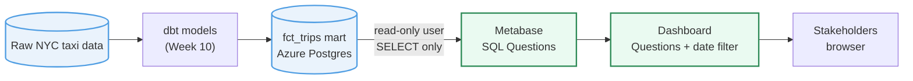

# NYC Taxi — Metabase Reference

Reference SQL for the **HYF Data Track Week 11 (Dashboarding)** Metabase exercises. Every Question
you build in Metabase is driven by a SQL query against the Week 10 dbt mart `fct_trips` — those
queries live here as runnable `.sql` files so you have a checkable source of truth. The
dashboard *assembly* (adding cards, wiring the date filter) stays in the Metabase UI, because the
whole point of the week is learning the BI tool.

`main` holds the finished reference SQL. Each exercise is a **branch** with an `EXERCISE.md`
(the click-steps) and either a SQL stub to complete or the reference SQL to paste. Diff against the
matching `-solution` branch.

## Architecture: source to dashboard



Metabase is **no-code BI**: each Question is a saved SQL query rendered as a chart; you arrange
Questions onto a Dashboard. It reads the same mart a Streamlit app would, through a read-only user.

## Exercises

Work through them in order: Exercise 2 builds on the Question you save in Exercise 1.

| # | Exercise | Start branch | Solution branch |
| --- | --- | --- | --- |
| 1 | Write a Metabase SQL Question | [`01-exercise-sql-question`](../../tree/01-exercise-sql-question) | [`01-exercise-sql-question-solution`](../../tree/01-exercise-sql-question-solution) |
| 2 | Build a dashboard with a date filter | [`02-exercise-dashboard-filter`](../../tree/02-exercise-dashboard-filter) | [`02-exercise-dashboard-filter-solution`](../../tree/02-exercise-dashboard-filter-solution) |

## Setup

```bash
git clone https://github.com/lassebenni/nyc-taxi-metabase-reference.git
cd nyc-taxi-metabase-reference
git switch 01-exercise-sql-question     # then read EXERCISE.md
```

Then log in to HYF Metabase and follow the `EXERCISE.md`. Replace `dev_yourname` in every query
with your actual schema (e.g. `dev_jana`).

## Prerequisites

- Logged in to HYF Metabase (URL in the Week 11 chapter).
- Your Week 10 `fct_trips` table populated in `dev_<name>` on the shared Azure Postgres, visible
  in Metabase under **Databases**.
