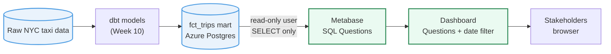

# NYC Taxi — Metabase Reference
### Exercise 2 · Dashboard with a date filter

Reference SQL for the **HYF Data Track Week 11 (Dashboarding)** Metabase exercises. Each Question is driven by a SQL query against the Week 10 dbt mart `fct_trips`; those queries live here as runnable `.sql` files. The dashboard *assembly* stays in the Metabase UI.

You are on **`02-exercise-dashboard-filter`**: combine two saved Questions into a Dashboard and wire a date-range **field filter**. The Questions' SQL is provided in `sql/`; the exercise is the dashboard UI and the filter, not writing new SQL.

Follow **`EXERCISE.md`** in this branch, then compare against `02-exercise-dashboard-filter-solution`.

> 🧭 **All branches:** see the [`main`](../../tree/main) branch for the full exercise map.

## Architecture: source to dashboard



## Setup

```bash
git switch 02-exercise-dashboard-filter     # then read EXERCISE.md
```

Log in to HYF Metabase and follow `EXERCISE.md`. Replace `dev_yourname` in every query with your actual schema (e.g. `dev_jana`).

## Prerequisites

- Logged in to HYF Metabase (URL in the Week 11 chapter).
- Your Week 10 `fct_trips` table populated in `dev_<name>` on the shared Azure Postgres, visible in Metabase under **Databases**.
